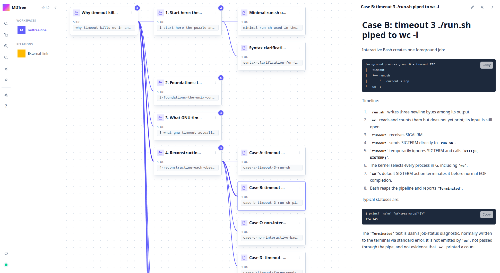

# MDTree

MDTree is a local-first knowledge base for structured tree data. Humans explore
it visually, AI agents work with it through MCP, and computer systems integrate
with it through the CLI or an API—all against the same portable `.mdtree`
workspace.



## Build and connect

MDTree requires Rust 1.88 or newer.

```bash
git clone https://github.com/sidnaZ/mdtree-ui.git
cd mdtree-ui
cargo build --release --locked
```

Install the CLI and MCP server, then add Cargo's binary directory to `PATH`:

```bash
cargo install --locked --path crates/mdtree-cli
cargo install --locked --path crates/mdtree-mcp
export PATH="$HOME/.cargo/bin:$PATH"
```

Register the MCP server with Codex and Claude Code. The default workspace is
`.mdtree` in the current directory:

```bash
codex mcp add mdtree -- mdtree-mcp --allow-write --allow-workspace-switch --workspace-root .
claude mcp add --transport stdio --scope user mdtree -- mdtree-mcp --allow-write --allow-workspace-switch --workspace-root .
```

## License and contact

MDTree is dual-licensed under the [GNU Affero General Public License v3.0](LICENSE)
and a separate [commercial license](COMMERCIAL-LICENSE.md). Use MDTree freely
under the AGPL-3.0, including for commercial purposes, as long as you comply
with its terms (notably, publishing source for any modified version you run as
a network service). If that doesn't work for you—for example, embedding
MDTree in closed-source software or hosting a modified version without
releasing your changes—a commercial license is available. For commercial
licensing, questions, or feedback, [contact the maintainers](https://github.com/sidnaZ/mdtree/issues).
